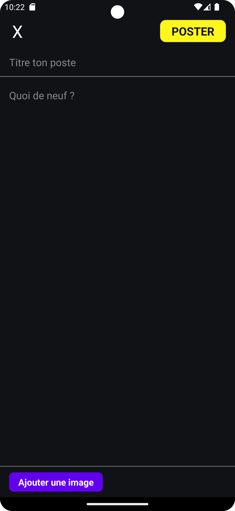
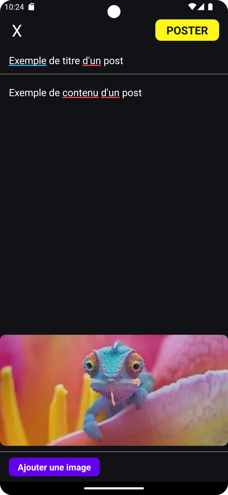
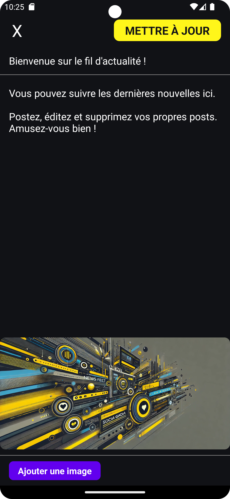

# Fil d'actualité Mately par Mathis Malherbe

Ce projet est une application en React Native de fil d'actualité. Il a été créé dans le cadre d'une candidature pour une alternance chez Mately.

## Table des matières

- [Aperçu](#aperçu)
- [Installation](#installation)
- [Structure du projet](#structure-du-projet)
- [Composants principaux](#composants-principaux)
- [Technologies utilisées](#technologies-utilisées)
- [Auteur](#auteur)

## Aperçu

### Page principale

---

### Page d'ajout d'un post
<div style="display: flex; flex-direction: row;">
    
    
</div>
---

### Page principale après ajout

---

### Page de modification d'un post

---

## Installation

1. Installez les dépendances nécessaires :

    ```bash
    npm install
    # ou
    yarn install
    ```

2. Pour exécuter l'application sur un émulateur Android ou iOS, utilisez les commandes suivantes :

- Android :

    ```bash
    npx react-native run-android
    ```

- iOS :

    ```bash
    npx react-native run-ios
    ```

## Structure du projet

Les ajouts et/ou modifications sont sur les fichiers/dossiers suivants :

```plaintext
.
├── assets
├── components
│   ├── shared
│   │   └── Button.js
│   ├── AddPostScreen.js
│   ├── EditPostScreen.js
│   ├── FeedScreen.js
│   ├── LogoTitle.js
│   └── PostItem.js
├── redux
│   ├── actions.js
│   ├── reducers.js
│   └── store.js
├── screenshots
├── App.tsx
├── package.json
└── README.md
```

## Composants principaux

### `App.tsx`
Configure le fournisseur Redux et la navigation.

### `components/FeedScreen.js`
Affiche le fil d'actualité avec la liste des posts. Permet d'accéder à l'écran d'ajout de post.

### `components/AddPostScreen.js`
Ecran permettant d'ajouter un nouveau post avec un titre, un contenu et une image.

### `components/EditPostScreen.js`
Ecran permettant de modifier un post existant.

### `components/PostItem.js`
Composant affichant un post individuel avec son titre, son contenu, son image, et des boutons pour éditer ou supprimer le post.

### `components/LogoTitle.js`
Affiche le header de l'application dans l'écran principal'.

### `redux/actions.js`
Définit les actions Redux pour ajouter, mettre à jour et supprimer des posts.

### `redux/reducers.js`
Contient le réducteur Redux pour gérer l'état des posts.

### `redux/store.js`
Configure le magasin Redux.

## Technologies utilisées

- [React Native](https://reactnative.dev/)
- [Redux](https://redux.js.org/)
- [React Navigation](https://reactnavigation.org/)
- [Moment.js](https://momentjs.com/)

## Auteur

- **Mathis Malherbe**
